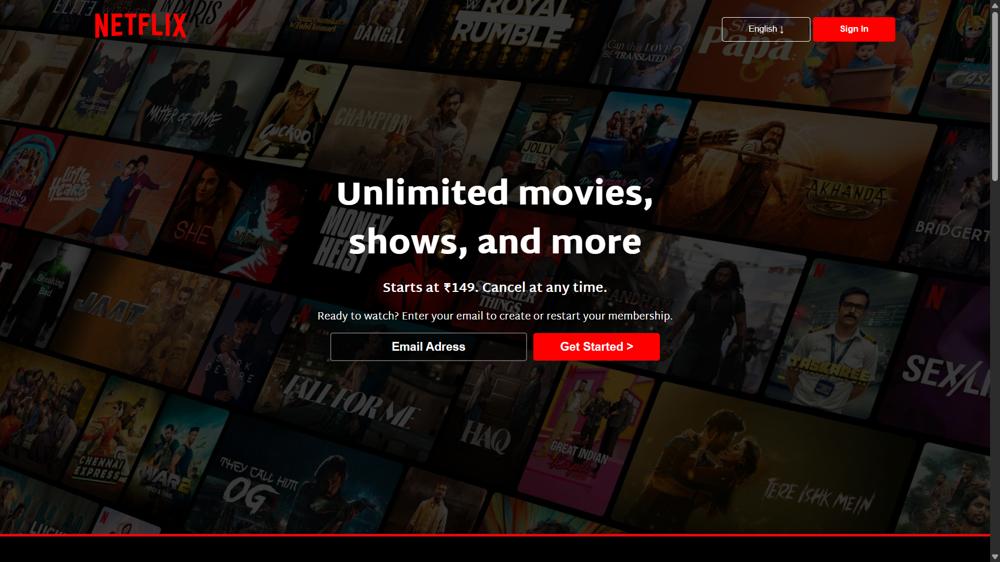

# 🎬 Netflix Clone

A responsive Netflix landing page clone built using **HTML and CSS**.
This project replicates the look and feel of Netflix’s homepage with a fully custom UI and layout.

---

## 🚀 Features

* Fully responsive design (mobile + tablet + desktop)
* Clean and modern Netflix-inspired UI
* Hero section with background banner
* Navigation bar with logo and buttons
* Multiple content sections (cards, layouts)
* Smooth layout scaling across devices

---

## 🛠️ Tech Stack

* HTML
* CSS

---

## 🧠 Development Note

* Entire UI is **designed and built by me**
* Fully responsive layout created without any frameworks
* No AI tools were used in building this project

---

## 📁 Project Structure

```
netflix-clone/
│
├── index.html
├── style.css
├── favicon.ico
├── README.md
├── assets/
└── screenshots/
    └── image.png
```

---

## 📸 Screenshot



---

## ⚡ How to Run

1. Download or clone the repository
2. Open `index.html` in your browser

---

## 💡 Future Improvements

* Add JavaScript for interactivity
* Movie slider functionality
* Authentication UI (Sign in / Sign up flow)
